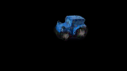
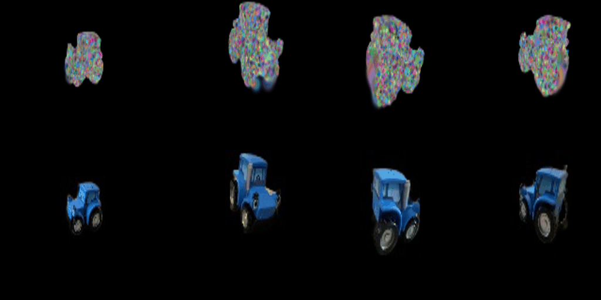

# Nerf-and-3DGS
implementation of NERF and 3DGS

## Acknowledgements and references

This project referenced files from the following repositories:

-https://github.com/learning3d/assignment3 - [Referenced some structures and how to load dataset]

## Nerf
### 1.1 Data
Donload the lego bulldozer dataset(png x1, pth x1, licence x1) via https://dl.fbaipublicfiles.com/pytorch3d_nerf_data/lego.png

https://dl.fbaipublicfiles.com/pytorch3d_nerf_data/lego.pth

https://dl.fbaipublicfiles.com/pytorch3d_nerf_data/lego_license.txt. And put them into the 'data' folder.

### 1.2 Result

## 3DGS
### 1.1 result

